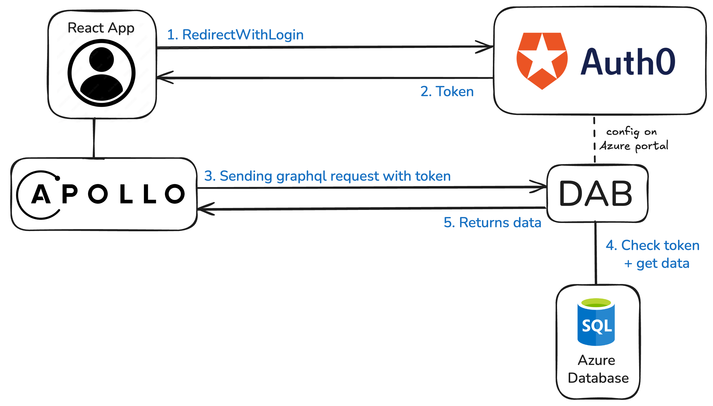

# Technical Specification

## 1. Project Overview

This project is a secure React frontend that integrates with Auth0 for authentication, Apollo Client for GraphQL queries, and Azure Data API Builder (DAB) as the GraphQL backend. The application supports organization-level access control and ensures that only authenticated users from the right organization can view specific data.

## 2. Authentication Flow

1. Auth0 is used for login/logout, user session management, and ID token issuance.
2. Users must be authenticated to access protected routes (`/projects`).
3. Tokens are retrieved and injected into GraphQL requests by Apollo Client using a custom `authLink`.
4. Claims (e.g., `org_id`) are extracted from the token to filter data at the query level.

## 3. Stack Overview

### GraphQL and Apollo Integration

- Apollo Client is configured with:
  - `authLink` to attach bearer tokens to requests.
  - `errorLink` to handle authentication-related errors.
- GraphQL queries are organized in `src/graphql` (e.g., `GET_PROJECTS`).
- DAB serves as the backend, exposing a GraphQL API from an Azure SQL database.
- Apollo Client sends a GraphQL request to Azure DAB.
- The query includes a filter on `organization_id` based on the JWT claim.

### Auth0

- Used for authentication and user session management.
- Custom claim `org_id` is included in the JWT and consumed on the client.

[//]: # (- The app redirects users to Auth0 when authentication is required or when users click the login button.)

### Azure Data API Builder (DAB)

- Exposes a GraphQL API based on a SQL Server schema.
- No filtering is applied server-side on `organization_id`, this is handled client-side.
- Deployed on Azure App Service, CI/CD is handled via GitHub Actions.

### TanStack Router

- Manages frontend routes.
- Navigation and route protection handled via beforeLoad on a route layout (e.g. `_auth`).

## 4. Security Best Practices

- Token-based authentication (JWT) with bearer headers.
- Claims extracted securely via `useAuth0` and validated.
- Role/organization-specific data access enforced via query filtering.
- Sensitive routes (`/projects`) are protected by both route guards and frontend checks.
[//]: # (- Errors are captured globally with an `ErrorBoundary` &#40;via `react-error-boundary`&#41;.)
- Apollo's `ErrorLink` intercepts GraphQL errors for centralized handling.

## 5. Architecture Diagram
1. Authentication via Auth0
   - The user logs in via Auth0.
   - Auth0 returns an access token.
2. Sending GraphQL requests with Apollo Client
   - Apollo Client retrieves the access token.
   - It sends authenticated GraphQL requests to Data API Builder (DAB).
3. Validation and execution of requests by DAB
   - DAB verifies the validity of the token sent by Apollo Client.
   - DAB interacts with the Azure database to execute the request.

## 6. Code Structure
- `src/pages`: React pages rendered for each route, e.g. `index.tsx`, `profile.tsx`.
- `src/routes`: TanStack Router route definitions using `createFileRoute()`.
- `src/hooks`: Custom hooks related to authentication and authorizations.
- `src/graphql`: Contains the `GET_PROJECTS` GraphQL query.
- `src/providers`: Contains the apollo setup with token injection and error handling.
- `src/layout`: Contains the main layout used on each pages, including the menu and the login button.
- `src/components`: react components used on pages.
- `src/__mocks__`: Mocks for Auth0 and other dependencies used in unit tests.

- `dab-local`: used to run dab locally
- `dab-backend`: dab config and script to deploy via GitHub Actions for Azure App Service.

## 7. Style

- Use Tailwind CSS for styling.
- Dark mode support via `dark` class depending on system preference.

## 8. Testing Strategy

- Vitest + React Testing Library.
- Auth0 is mocked inline to simulate authenticated users.
- Apollo queries are mocked inline using `MockedProvider` from `@apollo/client/testing`.
- Tests check conditional rendering based on authentication, as well as proper data rendering from GraphQL responses.
- Coverage focuses on `ProjectsPage` and its key states (authenticated, error, authorized...).
- Some basic other tests are created by copilot and chatgpt, just wanted to see how it performs.

## 9. CI/CD

- GitHub Actions is used to deploy the backend part
- Frontend app is [deployed here](https://tab.proustibat.dev/) with Vercel, which automatically builds and deploys on push to `main` branch.

## 10. Limitations & Simplifications

- Organization-based filtering is done only client-side.
- No server-side enforcement of tenant access in DAB.
- No E2E or integration tests implemented.
- Roles and RBAC are not used, only basic claim filtering.
- Apollo cache configuration is basic and could be improved for larger apps.

## 11. Conclusion

The project follows clear separation of concerns, reusable custom hooks, protected routing using TanStack Router, and good security practices for Auth0 and GraphQL. This setup ensures clarity, testability, and extensibility for future use cases.

---

# Summary

| Requirement                                        | Completed | Details                                                                 |
|----------------------------------------------------| --------- |-------------------------------------------------------------------------|
| **Auth0 implementation with organization support** | ✅         | Organization-based access implemented with roles and custom claims.     |
| **Protected routing with TanStack Router**         | ✅         | Auth protection handled via `useProtectedRoute` and conditional rendering. |
| **Apollo Client with `authLink`**                  | ✅         | Tokens are injected into GraphQL requests correctly.                    |
| **GraphQL queries filtered by organization**       | ✅         | Data is filtered using `organization_id` in the query.                  |
| **Error handling with Apollo**                     | ✅         | `ErrorLink` is set up to catch authentication and GraphQL errors.       |
| **Global error boundaries**                        | ✅         | `react-error-boundary` is properly used in the root layout.             |
| **Secure communication channels**                  | ✅         | JWTs, query-level data filtering, and no sensitive data leaks.          |
| **Unit tests**                                     | ✅         | Tests written with Vitest and React Testing Library, covering key logic. |
| **GitHub usage and CI/CD setup**                   | ✅         | DAB deployment is automated with GitHub Actions, and the repo is structured. |
| **Technical documentation**                        | ✅         | `README.md` is structured and clearly explains the system.              |
| **Clear architecture diagram**                     | ✅         | A clean diagram is integrated into the doc with accurate flow direction. |
